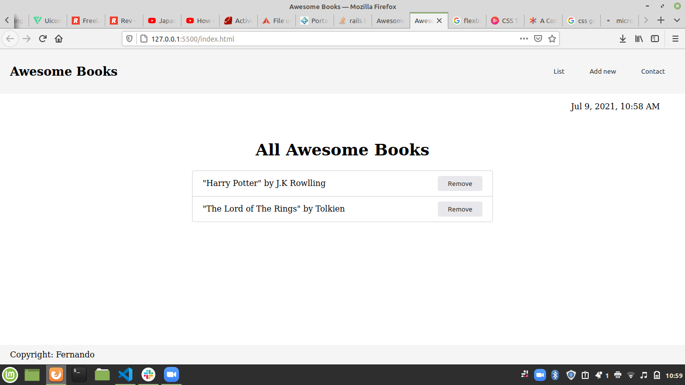

# Awesome Books

> In this project, we built a basic website that allows users to add/remove books from a list. Only Vanilla JavaScript objects and arrays. The elements are dynamically modified with DOM and basic events.

## Built With

- HTML
- CSS
- Javacript ES6

## Getting Started

### Requirements

- A github account connected to your PC
- VSCode or another similar IDE
- Live Server or another similar runtime extension

### Setup

Create a new folder/directory for the project

### Install

- open your terminal on your OS
- go to the desired folder/directory that you want to have the project in
- `git clone https://github.com/fernandorpm/awesome-books.git`
- `cd awesome-books`
- right click the `index.html` file and click on `Open with live server`

## Authors

👤 **Kingsley McSimon O**

- GitHub: [@githubhandle](https://github.com/githubhandle)
- Twitter: [@twitterhandle](https://twitter.com/twitterhandle)
- LinkedIn: [LinkedIn](https://linkedin.com/in/linkedinhandle)

👤 **Fernando R P Marques**

- GitHub: [@fernandorpm](https://github.com/fernandorpm)
- Twitter: [@rpm_fernando](https://twitter.com/rpm_fernando)
- LinkedIn: [Fernando R P Marques](https://linkedin.com/in/fernandorpm)

## 🤝 Contributing

Contributions, issues, and feature requests are welcome!

Feel free to check the [issues page](../../issues/).

## Show your support

Give a ⭐️ if you like this project!

## 📝 License

This project is [MIT](./MIT.md) licensed.
